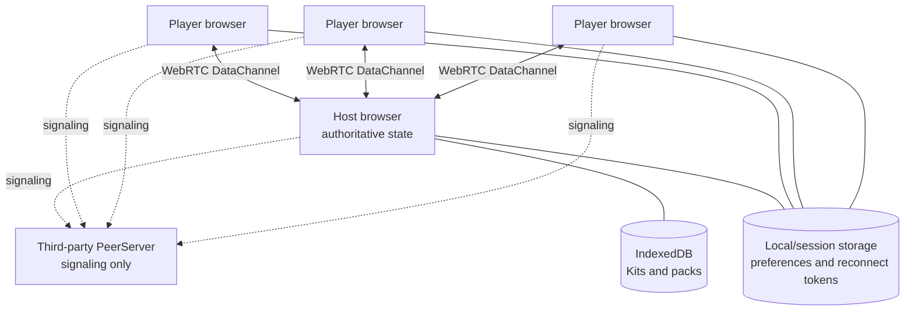
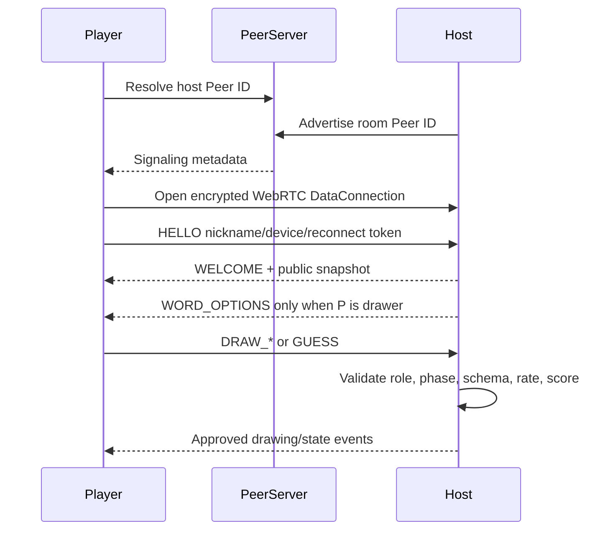

# DrawRelay

DrawRelay is a zero-install, browser-based drawing and guessing game. A host creates a room, shares a short code, link, or QR code, and players join from phones, tablets, or computers with only a nickname.

The host is authoritative. Player devices connect to the host in a WebRTC star topology, submit guesses, and become touch drawing boards when selected. No account, database, camera, microphone, or screen-capture permission is required.

## Included product

### Free game

- One-tap host room creation
- Link, short code, QR code, clipboard, and Web Share invitations
- Host-centered PeerJS DataConnections
- Private drawer word choices
- Live normalized-coordinate drawing strokes
- Guess matching, near-match hints, timers, scoring, round results, and leaderboard
- Player refresh/reconnect tokens and late-join snapshots
- Touch, mouse, and stylus drawing
- Fullscreen public display, Wake Lock, optional sound and vibration
- High contrast, large type, reduced motion, keyboard labels, and screen-reader live regions
- Bundled family-safe packs and ad-hoc session words
- Installable PWA shell

### Premium: Game Night Kits

Game Night Kits save an entire reusable host setup locally: word packs, round settings, drawer mode, accessibility preferences, and theme metadata. Kits can be exported and imported with Web Crypto AES-GCM encryption and a user-selected passphrase.

The implementation includes a local license-validation mock. Use `DRAWRELAY-PREMIUM` during development. The production payment/verification integration point is marked with `AIDEV-TODO` in `app.js`.

## Architecture



### Host-star message flow



The PeerServer helps peers discover one another and exchange WebRTC setup messages. Gameplay payloads use WebRTC DataChannels. Depending on NAT and firewall conditions, ICE infrastructure may route encrypted WebRTC packets through a TURN relay.

## Repository structure

```text
drawrelay/
├── index.html               # Application screens and accessible UI
├── styles.css               # Responsive visual system
├── app.js                   # Networking, UI, drawing, game orchestration
├── game-core.js             # Pure rules, validation, matching, scoring
├── storage.js               # IndexedDB and encrypted kit portability
├── manifest.webmanifest     # PWA metadata
├── sw.js                    # App-shell and pinned dependency cache
├── vendor/
│   ├── peerjs.min.js        # Local vendor slot
│   ├── qrcode.min.js        # Local vendor slot
│   └── fetch-vendor.sh      # Fetch pinned dependency builds
├── icons/
├── tests/game-core.test.mjs
├── package.json
├── LICENSE
└── README.md
```

## Run locally

A secure browser context is required for several APIs. `localhost` qualifies.

```bash
cd drawrelay
python3 -m http.server 8000
```

Open `http://localhost:8000`.

The repository contains lightweight vendor slots and automatically falls back to pinned public CDN builds. To remove the runtime CDN dependency, run:

```bash
./vendor/fetch-vendor.sh
```

Then reload the app. Multiplayer still requires access to PeerJS signaling infrastructure.

## Tests

Requires Node.js 20 or newer.

```bash
npm test
```

The dependency-free test suite covers guess normalization, answer matching, conservative near matches, scoring, drawer rotation, word validation, protocol validation, state transitions, room-code handling, and nickname sanitization.

## GitHub Pages deployment

1. Create a repository and copy these files to its default branch.
2. Run `./vendor/fetch-vendor.sh` and commit the resulting pinned local files for a fully self-contained app shell.
3. In GitHub, open **Settings → Pages**.
4. Under **Build and deployment**, choose **Deploy from a branch**.
5. Select the default branch and `/ (root)` folder.
6. Save and open the generated Pages URL.

All paths are relative, so deployment works under a project subpath such as `https://username.github.io/drawrelay/`.

## Privacy model

- No DrawRelay account or application database exists.
- No analytics, advertising, fingerprinting, or remote fonts are included.
- Drawings and guesses are not intentionally sent to an owned application server.
- The host stores game state in memory and a recoverable session snapshot in `sessionStorage`.
- Preferences and license state use `localStorage`.
- Kits use IndexedDB and encrypted exports use PBKDF2 plus AES-GCM through Web Crypto.
- Signaling infrastructure can observe connection metadata.
- WebRTC peers can normally learn one another's network addresses as part of WebRTC connectivity.
- A malicious host controls its own room and can inspect host-authoritative game state, including the answer.

## Protocol and security controls

Messages use a versioned envelope:

```js
{
  v: 1,
  type: "GUESS",
  payload: { guess: "telescope" },
  ts: 1783746000000
}
```

The host validates the protocol version, allowlisted message type, payload shape, sender role, game phase, message size, string and array limits, point ranges, room capacity, guess rate, drawing rate, and DataChannel backpressure. Player-controlled UI is inserted with `textContent`, not unsanitized HTML.

Clients never authoritatively set scores, timers, answers, drawers, or game state.

## Browser support

Target browsers:

- Current Chrome and Edge on desktop and Android
- Current Safari on iPhone, iPad, and macOS
- Current Firefox

Optional APIs such as Wake Lock, Web Share, vibration, fullscreen, and PWA installation degrade gracefully. WebRTC may be blocked on restrictive corporate, school, hotel, or guest networks.

## Manual test checklist

### Basic room

- [ ] Host creates a room in one tap.
- [ ] Room code is eight readable Base32 characters.
- [ ] Copy code, copy link, QR code, and Web Share work where supported.
- [ ] Two browser tabs can host and join.
- [ ] Three physical player devices can join.
- [ ] Duplicate nicknames receive a readable suffix.
- [ ] Room capacity is enforced.

### Gameplay

- [ ] Host starts a five-round game.
- [ ] Random drawer does not immediately repeat when alternatives exist.
- [ ] Host-choice drawer dialog works.
- [ ] Only the drawer receives word choices and the selected word.
- [ ] Drawing appears live on host and guessing devices.
- [ ] Pen, colors, sizes, eraser, undo, and clear work on touch.
- [ ] Drawer cannot submit guesses.
- [ ] Exact normalized answer succeeds.
- [ ] A conservative typo displays “Very close.”
- [ ] Earlier guesses score more.
- [ ] Timer expires and round results reveal the answer.
- [ ] Final leaderboard and rematch work.

### Resilience

- [ ] Player refresh restores nickname and score when the host remains open.
- [ ] Temporary airplane mode displays reconnecting and recovers.
- [ ] Late join receives current public state and drawing.
- [ ] Late join does not receive a hidden word unless selected as drawer.
- [ ] Host refresh restores the session and pauses an active round.
- [ ] Host loss produces a clear reconnecting state for players.
- [ ] Invalid and oversized protocol payloads are ignored or rejected.
- [ ] Slow DataChannel backpressure does not create unbounded sends.

### Devices and accessibility

- [ ] iPhone Safari join and drawing flow.
- [ ] Android Chrome join and drawing flow.
- [ ] Desktop Chrome host fullscreen.
- [ ] Tablet portrait and landscape drawing.
- [ ] TV/projector lobby and scoreboard readability.
- [ ] Keyboard-only navigation.
- [ ] Screen-reader labels and live announcements.
- [ ] Large type, high contrast, and reduced motion.
- [ ] Sound and vibration can be disabled.

### Premium and deployment

- [ ] Free game works without a license.
- [ ] Mock key `DRAWRELAY-PREMIUM` unlocks Kits.
- [ ] Kit saves and loads from IndexedDB.
- [ ] Encrypted kit export/import works with the correct passphrase.
- [ ] Incorrect passphrase fails without exposing kit data.
- [ ] Service worker caches the application shell.
- [ ] GitHub Pages subpath deployment works.

## Known limitations

- The initial version depends on the public PeerJS signaling service unless you configure and host a PeerServer.
- TURN availability and policy are controlled by the signaling/WebRTC environment; some restrictive networks may fail to connect.
- Host migration is not implemented. The host remains the authority for the room.
- A host refresh can restore the room state, but reconnect timing depends on release and reacquisition of the custom PeerJS ID.
- There is no server-enforced license system in this static MVP. The included validation is intentionally a local mock.
- Word packs are English-only in the bundled MVP.

## Production monetization integration

For a production license system, use a minimal verification endpoint or edge function that validates Lemon Squeezy or Stripe purchase state and returns a signed, device-bound entitlement. Keep player joining free. Do not place payment-provider secrets in the browser bundle.
